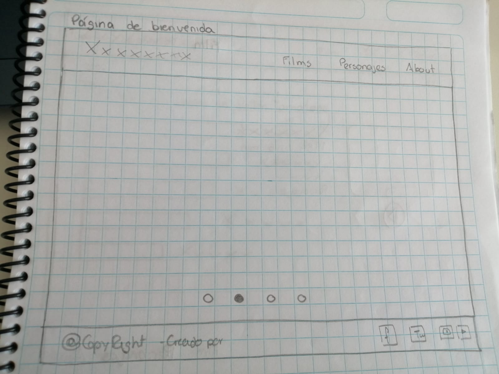
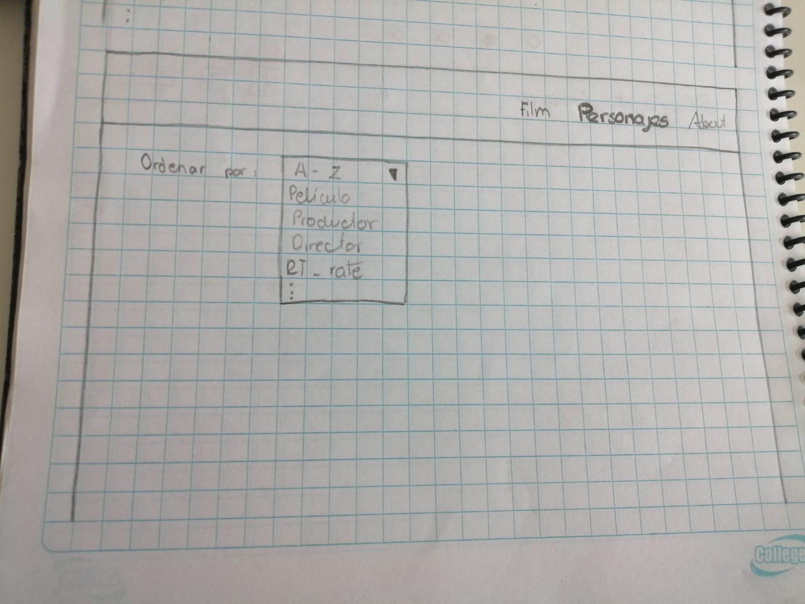

# StudioGhibli Library

## Índice

* [1. Resumen del proyecto](#1-resumen-del-proyecto)
* [2. Definición del producto](#2-definicion-del-producto)
* [3. Características del proyecto](#3-caracteristicas-del-proyecto)
* [4. Funcionalidad](#4-funcionalidad)
* [5. Prototipo](#5-prototipo)
* [6. Decisiones de diseño](#6-decisiones-de-diseño)
* [7. Interfaz de usuario](#7-interfaz-de-usuario)

***

## 1. Resumen del proyecto

Studio Ghibli Library

## 2. Definición del producto

### ¿Quiénes son los principales usuarios de producto?

### ¿Cuáles son los objetivos de estos usuarios en relación con tu producto?

### ¿Cómo crees que el producto que estás creando está resolviendo sus problemas?

## 3. Características del proyecto

## 4. Funcionalidad

## 5. Prototipo

*Prototipo baja fidelidad
## El prototipo inicial fue diseñado a mano

*Prototipo alta fidelidad
## El segundo prototipo fue diseñado con la herramienta Figma

## 6. Decisiones de diseño

- Se utilizo el logo del largometraje y sus colores insignia. 
- Se inserto un pie de página donde se muestran las redes sociales de Studio Ghibli.
- Se opto por implementar una interfaz fácil de usar, presentando un diseño amigable y sencillo.

## 7. Interfaz de usuario

## Interfaz final 

