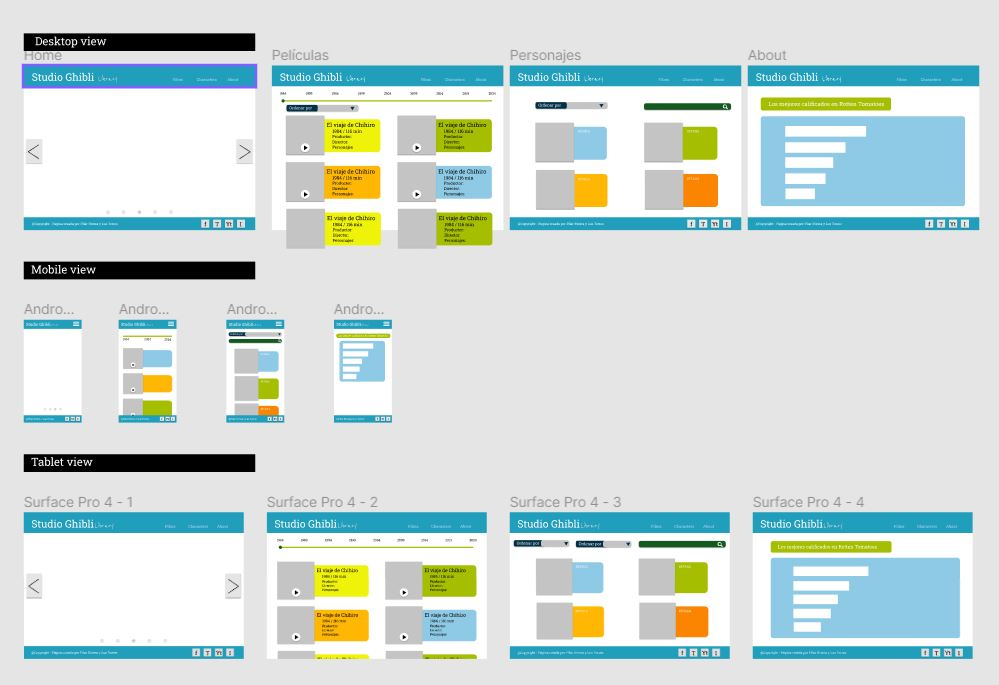
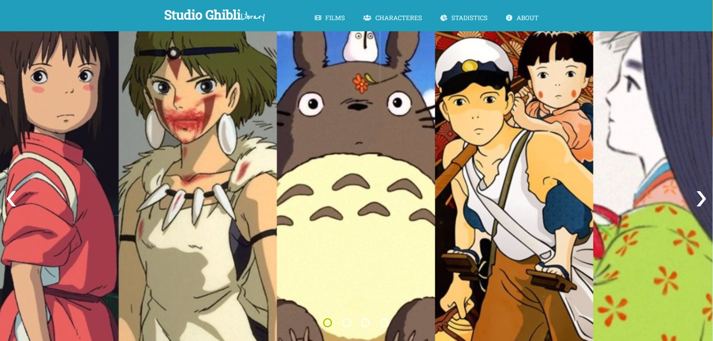
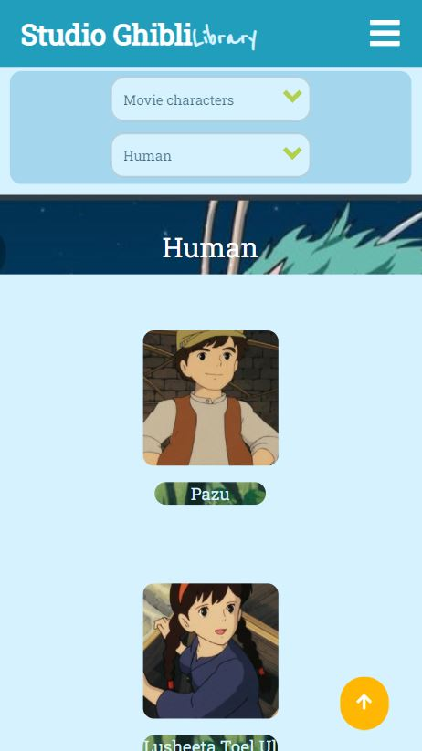
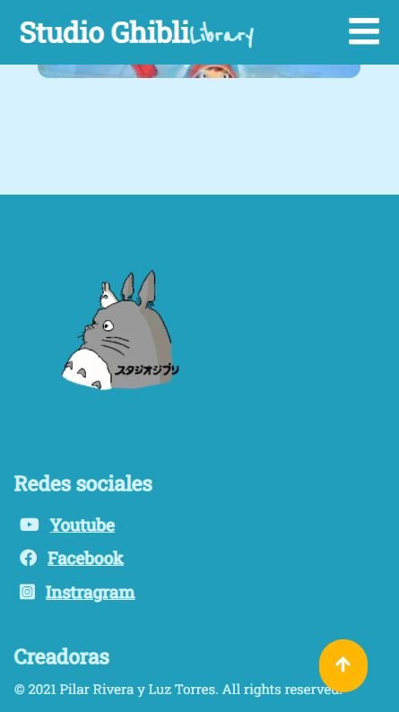

# StudioGhibli Library

***

## 1. Resumen del proyecto 📌

Studio Ghibli Library es un aplicativo web, el cual permite visualizar un conjuntos de datos de la filmografía Studio Ghibli. Estos datos se presentan de manera ordenada, facilitando la busqueda de lo que se desea observar.

## 2. Definición del producto 📝

### ¿Quiénes son los principales usuarios de producto?
* Seguidors de las películas de Studio Ghibli
* Cualquiera que desee conocer datos importantes sobre Studio Ghibli

### ¿Cuáles son los objetivos de estos usuarios en relación con tu producto?
Visualizar de manera sencilla los datos más importantes de Studio Ghibli. Tales como:

* Películas 🎞️
* Personajes 🙋‍♀️
* Puntajes en Rotten Tomatoes 🍅

### ¿Cómo crees que el producto que estás creando está resolviendo sus problemas?

Studio Ghibli Library nos permite ver los datos de manera ordenada y sencilla. Permitiendo reducir el tiempo de busqueda según la necesidad del usuario.

## 3. Características del proyecto ✅

El desarrollo del producto proyecto utiliza diversos métodos para mostrar los datos de preferencia del usuario. 

## 4. Funcionalidad ⚙️

Para su correcto funcionamiento el usuario debera elegir entre los métodos de filtrado y ordenado que se presentan en la interfaz, como:

* Filtrado de peliculas por director
* Filtrado de peliculas por productor
* Filtrado de personajes por peliculas
* Filtrado de personajes por especies
* rdenado por puntajes Rotten Tomatoes
* Ordenado por años de estreno ascendente y descendente
* Ordenado por letras de abecedario

## 5. Historias de Usuario 🗂️

## 6. Prototipo ⚒️

*Prototipo baja fidelidad
## El prototipo inicial fue diseñado a mano 1️⃣

*Prototipo alta fidelidad
## El segundo prototipo fue diseñado con la herramienta Figma 2️⃣

Link : [Figma](https://www.figma.com/file/oyIhJuBaVWTKzi1VcKnVk3/Ghibli?node-id=0%3A1)

## 7. Decisiones de diseño 🎨

- Se utilizo el logo del largometraje y sus colores insignia.
- Se inserto un pie de página donde se muestran las redes sociales de Studio Ghibli.
- Se opto por implementar una interfaz intuitiva, presentando un diseño amigable y sencillo.

## 8. Interfaz de usuario 📱💻

La interfaz del usuario presenta un menú de navegación el cual ofrece las diferentes secciones con las que cuenta la pagina. También, un catálogo completo de las peliculas de Studio Ghibli. Del mismo modo cuenta con secciones que muestran los filtros que se puede utilizar para las busquedas.

## 9. Test usabilidad 📱

Se realizo varios testeos en los cuales pudimos detectar diversos problemas para el usuario, debido a esto se añadio y/o modifico los siguientes elementosl

- Tamaño carrusel:
  Al inicio el carrusel no ocupada toda la pantalla y se veia parte de la siguiente sección. Se aumento la altura para que pudiera solo observarse la sección de bienvenida
- Titulo de los posters de las película:
  Inicialmente el poster de la pelicula y su titulo no estaban agrupados, lo cual el usuario confundia el de las películas
- Navegador estatico:
  El navegador propuesto solo se mostraba en la sección de bienvenida, sin embargo el usuario deseaba cambiar de sección sin la necesidad de ir al inicio de la pagina
- Boton actualizar:
  Una ves seleccionado los filtros requeridos por el usuario no se podia volver a observar el catalogo inicial, se opto por agregar el boton para darle una mejor experiencia al usuario
- Boton de subida:
  Se observo que el usuario tardaba mucho en ir al inicio de la pagina, se opto por agregar un boton que facilitara el desplazamiento
- Navegador hamburguesa:
  Se observo que al ingresar a la pagina en celulares el navegador ocupada mucho espacio por lo que se dio la opción de aparecer y desaparecer las opciones de navegación

## Interfaz final 🤩

